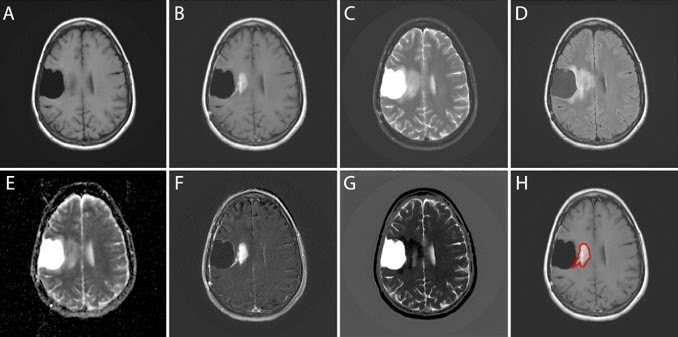

## Spatial sequence CNN-LSTM

### publication: Discriminating pseudoprogression and true progression in diffuse infiltrating glioma using multi-parametric MRI data through deep learning

MRI is the mainstay in the assessment of the tumor in the preoperative and postoperative period. During treatment and follow-up, in MRI studies, the treated tumors show an increase in size and enhancement in the absence of tumor recurrence without clinical deterioration. This is due to treatment-related effects and this can be divided into pseudoprogression (PsP) or radiation necrosis6.

Figure 1. Multiparametric MRI data

We proposed to use a multiparametric MRI data as a sequence input for the convolutional neural network with the recurrent neural network based deep learning structure to discriminate between pseudoprogression and true tumor progression

Spatial sequence CNN-LSTM

Figure 2. CNN-LSTM Architechture
